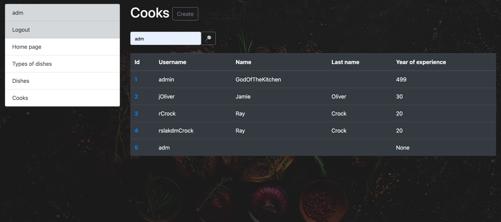

# Restaurant-Kitchen-Service

Django project for managing dishes and cooks in kitchen

## Check it out!

[Library project deployed to Render](https://restaurant-kitchen-service-b3o3.onrender.com/)

## Installation

Python3 must be already installed

```shell 
git clone https://github.com/Aleksandro777/Restaurant-Kitchen-Service
cd restaurant
python3 -m venv venv
source venv/bin/activate
pip install -r requirements.txt 
python manage.py runserver #starts Django server
```

## Features

* Authentication functionality for Cook/User
* Managing cooks, dishes and dishes type directly from website
* Powerful admin panel for advanced managing 

## Demo pages




## TEST USER

login: user
password: user12345

